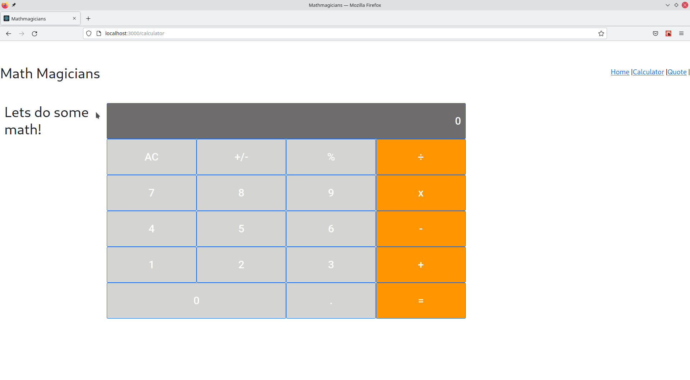

# Project Name

Math Magicians - A calculator built using react

This is a setup of the environment and tools needed to develop the React application.

## Built With

- JavaScript, HTML, CSS
- Webpack

## Live Demo

https://hardcore-murdock-d78537.netlify.app/

https://mathmagicians-kk.herokuapp.com/

## Getting Started

To get a local copy up and running follow these simple example steps.

### Prerequisites
- Node
- Web browser

### Setup
- Open terminal porgram
- Clone this repositiory by running `git clone https://github.com/kimothokamau/mathmagicians.git `

### Install
- Run `npm install`

### Usage
- Run `npm start`

### Run tests
- Coming soon

## Authors
 
**Kevin Kamau**
- Github: [@kimothokamau](https://github.com/kimothokamau)
- Twitter: [@kimothokk](https://twitter.com/kimothokk)
- Linkedin: [Kevin Kamau](https://www.linkedin.com/in/kevinkamauk/)

## 🤝 Contributing

Contributions, issues and feature requests are welcome!

Feel free to check the [issues page](https://github.com/kimothokamau/mathmagicians/issues)

## Show your support

Give a ⭐️ if you like this project!

## 📝 License

This project is [MIT](https://es.wikipedia.org/wiki/Licencia_MIT) licensed.
